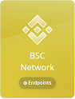

# Connect Web3 Dapp to Binance Smart Chain
Connecting your Web3 dapp to a Binance Smart Chain node with Moralis is quick and easy!

## Introduction

Head over [Moralis.io](https://moralis.io/) and sign up for a free account.

## BSC Node URL

Go to [Speedy Nodes](https://poc.moralis.io/speedyNodes) in the menu and click on the BSC Network "Endpoints" button. This will display your BSC Node urls.



Copy the "Mainnet" link. It will look something like this:<br>
`https://speedy-nodes-nyc.moralis.io/1a2b3c4d5e6f1a2b3c4d5e6f/bsc/mainnet`

## Connecting BSC Node to Web3 in JavaScript

Now that you have the BSC Node url it can be used to connect to Web3. The 2 main libraries for Web3 are [Web3.js](https://web3js.readthedocs.io/) and [Ethers.js](https://docs.ethers.io/).

### Web3.js

First import the Web3.js library.

```html
<script src="https://cdn.jsdelivr.net/npm/web3@latest/dist/web3.min.js"></script>
```

Then create an HttpProvider using your BSC Node url.

```javascript
const BSC_NODE_URL = "YOUR MORALIS BSC NODE URL HERE";
const provider = new Web3.providers.HttpProvider(BSC_NODE_URL);
const web3 = new Web3(provider);
```

### Ethers.js

Import the Ethers.js library

```html
<script src="https://cdn.ethers.io/lib/ethers-5.2.umd.min.js"
        type="application/javascript"></script>
```

Then we can create a JsonRpcProvider using our BSC Node url.

```javascript
const BSC_NODE_URL = "YOUR MORALIS BSC NODE URL HERE";
const provider = new ethers.providers.JsonRpcProvider(BSC_NODE_URL);
```

And that's it! You're dapp is connected to Binance Smart Chain! Now you can query transactions and smart contracts. See the docs for more details.

# Demo

To run the demo clone the repo then navigate to the root directory of the project. From there run a local web server. You will see the current Binance Smart Chain block number displayed and the transaction data for the hash in the demo.

The `index.html` file contains the Web3.js version and the `index-ethers.html` shows the Ethers.js version.

### Using Visual Studio Code with Live Server Extension

If you have an IDE like [Visual Studio Code](https://code.visualstudio.com/) with the [Live Server extension](https://marketplace.visualstudio.com/items?itemName=ritwickdey.LiveServer) you can right click on the `index.html` file and select `"Open with Live Server"` from the menu. This will open the web page in the browser on `localhost`.

### Using Python

If you don't use an IDE with a built in web server you can use the one included in Python. For Python 3:

```
python -m http.server
```

For older versions of Python:
```
python -m SimpleHTTPServer
```

# Learn More

## Tutorials

* [How to Connect to a BSC Node? Full Archive Binance Smart Chain Node - Ivan on Tech Explains](https://youtu.be/o5hIlOuRPeA)
* [Building BSC Web App - BSC Node Connection - Ivan on Tech Explains](https://youtu.be/_vy5oIXg9uA)

## Docs

* [Moralis](https://docs.moralis.io/)
* [Web3.js](https://web3js.readthedocs.io/)
* [Ethers.js](https://docs.ethers.io/)


<br><br><br>
Binance Chain Node, Binance Smart Chain Node, BSC Node, connect to BSC node, setup BSC Node, Web3, dapp, smart contract programming, Binance, Binance Chain, Binance Smart Chain, Moralis Speedy Node, Speedy Node, web3 provider, Metamask,
